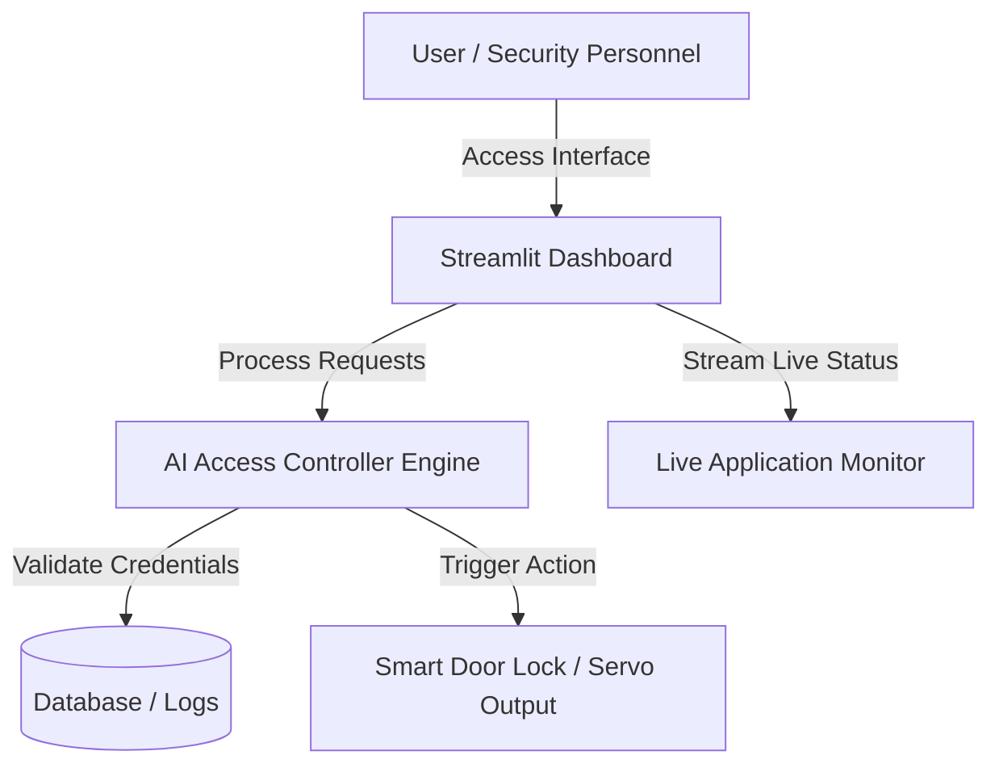

# 2582426---Christ-University-Smart-Door-Controller

Closes entrance doors at the start of class and reopens automatically after the 10-minute attendance window — removing manual security effort at every block

# **Christ University AI Smart Door Controller**

---

## **Problem Statement**
Modern campus facilities require secure, efficient, and automated access control solutions. Traditional manual key management or standalone access cards lack dynamic tracking, real-time status visibility, and automated multi-gate monitoring. 

This project delivers an intelligent, AI-powered Smart Door Controller application designed specifically for Christ University campuses. It provides real-time access monitoring, automated gate status visualization, and dynamic campus security control from a centralized dashboard.

---

## **Features**
* **Real-time Access Control:** Dynamically monitor entry/exit statuses across multiple campus gates.
* **Interactive AI Dashboard:** Built with Streamlit for fast, intuitive, and responsive security management.
* **Automated Logging:** Track student and staff access events with high accuracy.
* **Cloud Integration:** Scalable deployment ensuring continuous 24/7 uptime.

---

## **Architecture**



---

## **Installation & Usage**

### **Prerequisites**
* Python 3.10 or higher
* Git installed on your system

### **1. Clone the Repository**
```bash
git clone https://github.com/CHRIST-SDS/2582426---Christ-University-Smart-Door-Controller.git
cd 2582426---Christ-University-Smart-Door-Controller
```

### **2. Set Up Virtual Environment**
```powershell
# Create virtual environment
python -m venv venv

# Activate virtual environment (Windows PowerShell)
.\venv\Scripts\Activate.ps1
```

### **3. Install Dependencies**
```bash
pip install -r requirements.txt
```

### **4. Run the Application**
```bash
streamlit run app.py
```

---

## **Screenshots**


---

## **Demo Preview**


> **Note:** A full-resolution video recording is also available under the [`demo/`](demo/demo.mp4) directory.

---

## **Live Application**

The project is deployed and running live 24/7:
* **Live Dashboard:** [https://smart-door-controller.streamlit.app/](https://smart-door-controller.streamlit.app/)


